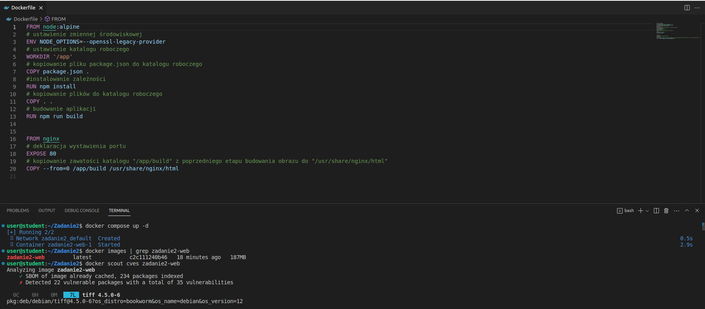
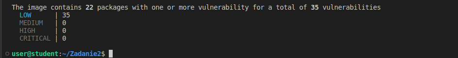
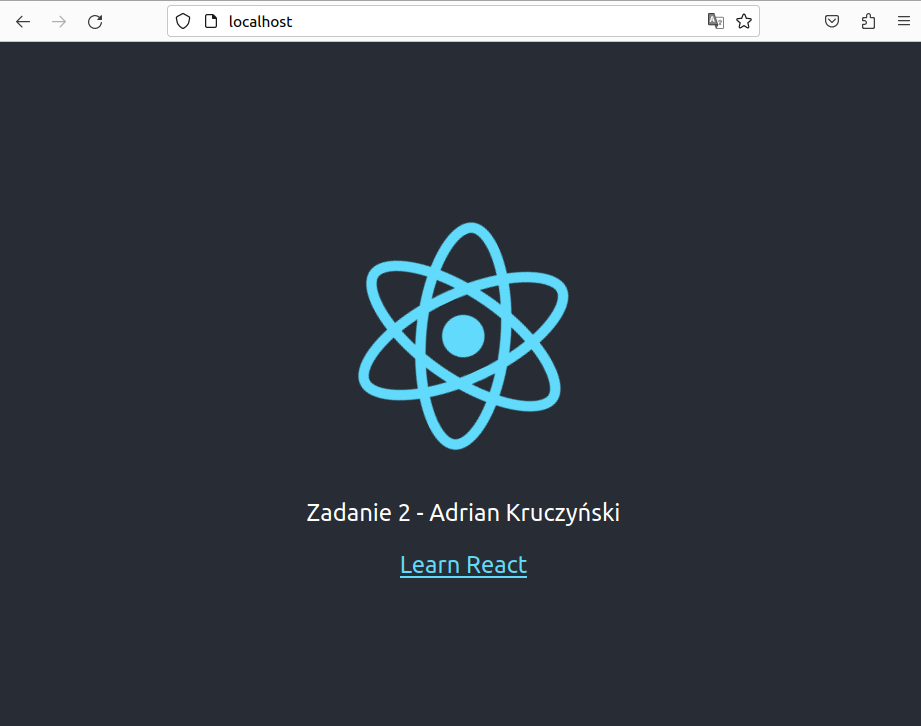

# Zadanie 2 - Technologie chmurowe

Część podstawowa
1. Budowanie kontenera i testowanie obrazu (CVE)
```
docker compose up -d 
```
```
docker scout cves zadanie2-web
```



2. Aplikacja



3. Wyłączenie kontenera
```
docker compose down
```

4. Podstawowy workflow jest w pliku : [zadanie2_podstawowe.yml](.github/workflows/zadanie2_podstawowe.yml)


#
Część dodatkowa

Do tagowania obrazów wykorzystano paczkę "Semantic versioning", która pozwala tagować obrazy zgonie z SemVer. 
Dzięki temu można tagować obrazy, po kolejnym uruchomieniu workflow obraz jest tagowany na wyższą wersje.

1. Dodatkowy workflow jest w pliku : [zadanie2_dodatkowe.yml](.github/workflows/zadanie2_dodatkowe.yml)
2. Wykonanie workflow znajduje się w zakładce Actions

https://github.com/adriankruczynski?tab=packages

